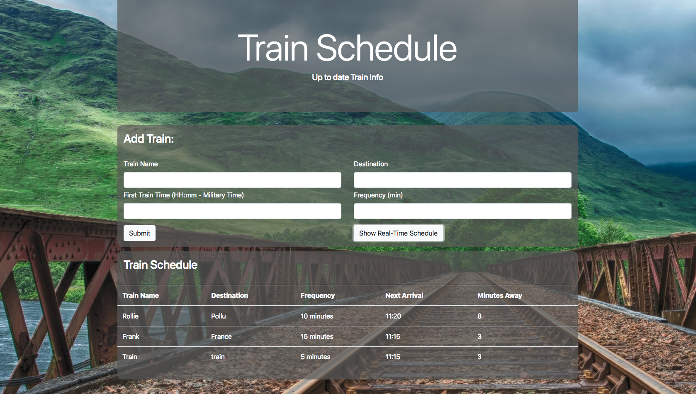

# Train-Activity
Train Schedule App 

* How the app works

1. Go to the form section and input data.

2. Click submit to get the data entered into the Train Schedule.

3. If the user just wants to view the train schedule, click the "Show Real-Time Schdeule" button.

